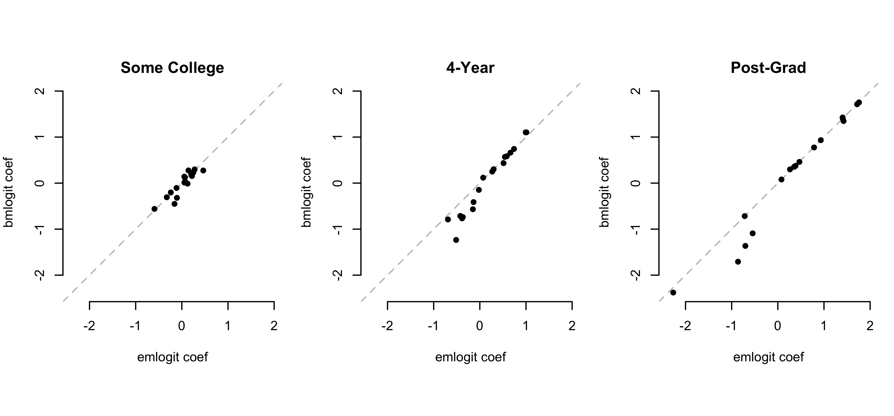
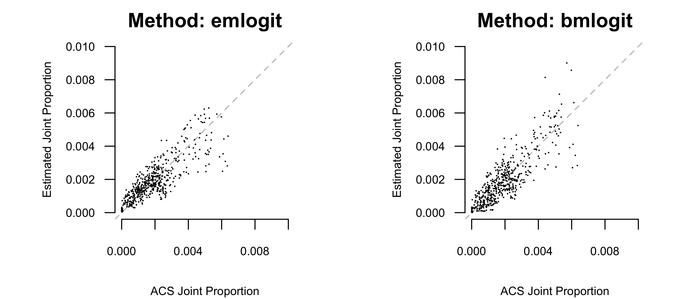
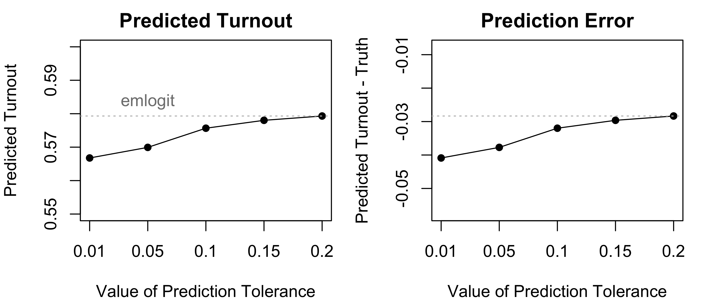
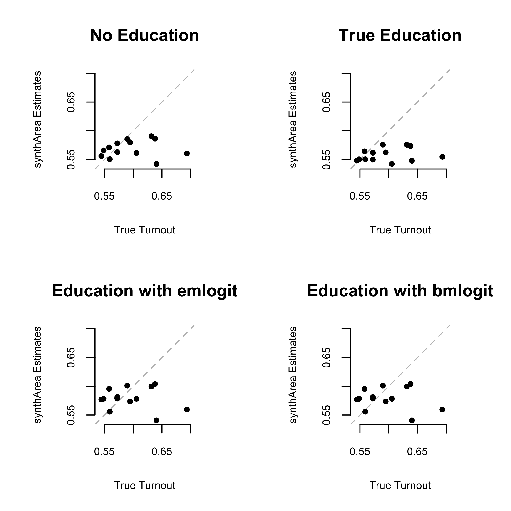

<!-- README.md is generated from README.Rmd. Please edit that file -->

# bmlogit

<!-- badges: start -->

<!-- badges: end -->

The goal of `bmlogit` is to estimate the multinominal logistic
regression with prediction constraints.

## Installation

You can install the development version from
[GitHub](https://github.com/) with:

``` r
# install.packages("devtools")
devtools::install_github("soichiroy/bmlogit")
```

## Implementation

``` r
library(bmlogit)
library(emlogit)
library(synthArea)

library(tidyr)
library(stringr)
```

We use the synthArea but we may use another Census covariate –
urban/rural. We use the
[citylab](https://github.com/theatlantic/citylab-data/blob/master/citylab-congress/citylab_cdi.csv)
index to classify NC’s 13 CDs into three categories

``` r
## load data
data(cces_nc)
data(acs_nc)

urban_recode <- function(cd) {
  case_when(
    cd %in% c("NC-03", "NC-07", "NC-08", "NC-11") ~ "Rural",
    cd %in% c("NC-01", "NC-02", "NC-05", "NC-06", "NC-10", "NC-13") ~ "Rural-suburban", 
    cd %in% c("NC-04", "NC-09", "NC-12") ~ "Sparse-suburban"
  )
}
cces_nc$rural <- urban_recode(cces_nc$cd)
acs_nc$rural <- urban_recode(acs_nc$cd)
```

We try to estimate the synthetic estimate of education using multinomial
logit models.

``` r
## population data
target_Y <- acs_nc %>% count(educ, wt = N) %>% mutate(prop = n / sum(n)) %>% pull(prop)
# target_Y <- c(0.462, 0.258, 0.184, 0.096)

pop_X <- model.matrix(~ age + gender + cd, data = acs_nc %>% count(age, gender, cd, wt = N))[,-1]
count_N <- acs_nc %>% count(age, gender, cd, wt = N) %>% pull(n)

## survey data
Y <- model.matrix(~educ-1, data = cces_nc)
X <- model.matrix(~age + gender + cd, data = cces_nc)[,-1]

## fit
fit <- bmlogit(Y = Y, X = X, 
               target_Y = target_Y, 
               pop_X = pop_X, 
               count_X = count_N,
               control = list(tol_pred = 0.01))


## multinominal logit without constraints
fit_em <- emlogit(Y = Y, X = X)
```

There is a set multinomial coefficients for each level of the outcome
(relative to baseline). Here there are coefficients for each of those
levels: 5 levels of age, 1 for gender, and 13 for rurality.



We can compare the resulting predicted values. Each prediction from the
regression is made for each X covariate, and then summed with weights
according to their known counts.

|              | Target | bmlogit | emlogit |   Raw |
| :----------- | -----: | ------: | ------: | ----: |
| HS or Less   |  0.394 |   0.389 |   0.298 | 0.294 |
| Some College |  0.327 |   0.327 |   0.354 | 0.355 |
| 4-Year       |  0.184 |   0.186 |   0.230 | 0.231 |
| Post-Grad    |  0.096 |   0.098 |   0.117 | 0.120 |

We clearly see that `bmlogit` is closer to the target population, and
`emlogit` defaults to the raw data.

## Application to Post-Stratification and Estimatig Turnout

We now try to estimate turnout post-stratifying on a synthetic
distribution that was created by either emlogit, bmlogit, or simple
weights.

The prediction for a third variable, `Y` (turnout in this case) should
go like this:

``` r
#' @param pop Population targets, with variables called `weight`
pred_turnout <- function(pop, microdata = cces_nc, XZ = c("educ", "age", "gender", "cd")) {
  
  XZw <- microdata %>% 
    group_by(!!!syms(XZ)) %>%
    summarise(turnout = sum(vv_turnout) / n(), .groups = "drop") %>%
    # join
    left_join(pop, by = XZ) %>%
    # rescale
    mutate(weight = weight / sum(weight))
  
  # inner product
  XZw$weight %*% XZw$turnout
}
```

We first do a simple weighted mean for the full joint (which we know in
this case).

``` r
# estimate state-wide quantity
data(districts_nc)
data(estimands_nc)

## raw estimate without adjustment
turnout_naive <- mean(cces_nc$vv_turnout)

## estimates stratified on educ, age, and gender
pop_tab <- acs_nc %>% 
  count(educ, age, gender, cd, wt = N, name = "N") %>%
  mutate(weight = N / sum(N))

turnout_nonpar <- pred_turnout(pop_tab)
```

For bmlogit:

``` r
popX_df <- acs_nc %>% 
  count(age, gender, cd, wt = N) %>% 
  transmute(age, gender, cd, prop_X = n / sum(n), N = n)


# compute the joint table
pr_joint <- predict(fit, newdata = pop_X)
colnames(pr_joint) <- c("HS or Less", "Some College", "4-Year", "Post-Grad")

pop_bmlogit <- bind_cols(popX_df, as_tibble(pr_joint)) %>%
  pivot_longer(cols = -c(age, gender, cd, prop_X, N),
               names_to = "educ", values_to = "pr") %>% 
  mutate(weight = prop_X * pr) # Pr(X) * Pr(Z | X)

turnout_bmlogit <- pred_turnout(pop_bmlogit)
```

For emlogit

``` r
pr_joint <- predict(fit_em, newdata = pop_X)
colnames(pr_joint) <- c("HS or Less", "Some College", "4-Year", "Post-Grad")

pop_emlogit <- bind_cols(popX_df, as_tibble(pr_joint)) %>%
  pivot_longer(cols = -c(age, gender, cd, prop_X, N),
               names_to = "educ", values_to = "pr") %>% 
  mutate(weight = prop_X * pr) # Pr(X) * Pr(Z | X)

turnout_emlogit <- pred_turnout(pop_emlogit)
```

## Application Results

We can check how each synthetic estimator compares to the true cells.



``` r
# turnout <- sum(estimands_nc$totalvotes) / sum(estimands_nc$vap)
# https://www.ncsbe.gov/results-data/election-results/voter-turnout-statistics
turnout <- 4.77e6 / sum(estimands_nc$vap)
```

And we finally compare the turnout estimates of the resulting
post-stratification. The true statewide turnout is 0.608.

| Estimator                  | Estimate |   Error |
| :------------------------- | -------: | ------: |
| Sample Mean                |    0.575 | \-0.033 |
| Post-str. w/ True Joint    |    0.570 | \-0.038 |
| Post-str. w/ bmlogit Joint |    0.567 | \-0.041 |
| Post-str. w/ emlogit Joint |    0.579 | \-0.028 |

We can also compare the performance of `bmlogit` by varying the value of
the tolerance parameter.



## Small Area Application

We can try these synthetic datasets on *small-area* estimates as well,
because we used cd as a covariate.

``` r

est_bm <- synthArea(
  vv_turnout ~ gender + educ + age | race + faminc + newsint + marstat,
  data         = cces_nc,
  pop_target   = pop_bmlogit,
  area_var     = "cd",
  popcount_var = "N", verbose = FALSE
)

est_em <- synthArea(
  vv_turnout ~ gender + educ + age | race + faminc + newsint + marstat,
  data         = cces_nc,
  pop_target   = pop_emlogit,
  area_var     = "cd",
  popcount_var = "N", verbose = FALSE
)

# don't include education
est_noeduc <- synthArea(
  vv_turnout ~ gender + age | race + faminc + newsint + marstat,
  data         = cces_nc,
  pop_target   = acs_nc,
  area_var     = "cd",
  popcount_var = "N", verbose = FALSE
)

# include education with true joint
est_educ <- synthArea(
  vv_turnout ~ gender + age + educ | race + faminc + newsint + marstat,
  data         = cces_nc,
  pop_target   = acs_nc,
  area_var     = "cd",
  popcount_var = "N", verbose = FALSE
)
```


