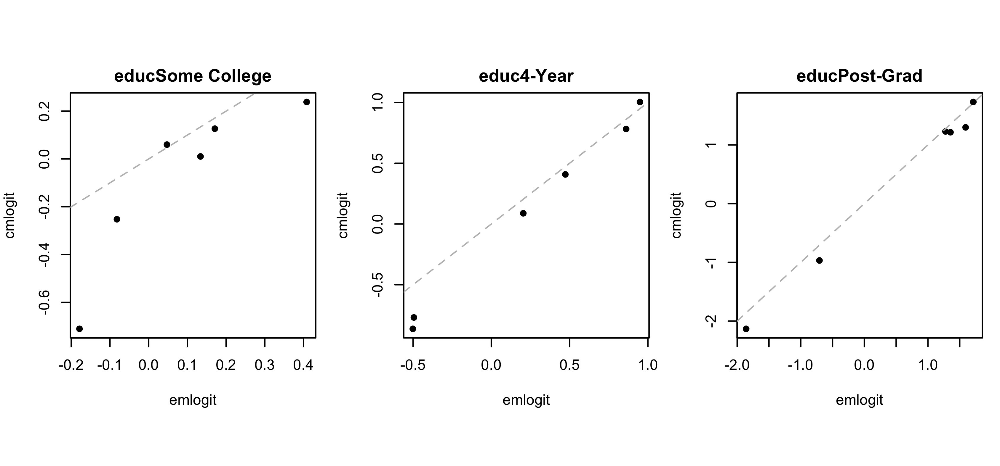

<!-- README.md is generated from README.Rmd. Please edit that file -->

# cmlogit

<!-- badges: start -->

<!-- badges: end -->

The goal of `cmlogit` is to estimate the multinominal logistic
regression with prediction constraints.

## Installation

You can install the development version from
[GitHub](https://github.com/) with:

``` r
# install.packages("devtools")
devtools::install_github("soichiroy/cmlogit")
```

## Example

This is a basic example which shows you how to solve a common problem:

``` r
library(cmlogit)
library(synthArea)
```

``` r
## load data
data(cces_nc)
data(acs_nc)

## population data
popY <- acs_nc %>% count(educ, wt = N) %>% mutate(prop = n / sum(n)) %>% pull(prop)
popX <- model.matrix(~age + gender, data = acs_nc %>% count(age, gender, wt = N))
popN <- acs_nc %>% count(age, gender, wt = N) %>% pull(n)

## survey data
Y <- model.matrix(~educ-1, data = cces_nc)
X <- model.matrix(~age + gender, data = cces_nc)

## fit
fit <- cmlogit(Y = Y, X = X, popY = popY, popX = popX, popN = popN,
               control = list(intercept = FALSE))


## result
bb0 <- cbind(0, matrix(fit$fit$x0, nrow = ncol(X)))
bbs <- cbind(0, matrix(fit$fit$solution, nrow = ncol(X)))

res <- cbind(popY,
  apply(popX %*% bbs, 1, function(x) exp(x) / sum(exp(x))) %*% (popN / sum(popN)),
  apply(popX %*% bb0, 1, function(x) exp(x) / sum(exp(x))) %*% (popN / sum(popN)),
  colMeans(Y)
)

knitr::kable(res, col.names = c("population", "cmlogit", "emlogit", "raw prop."),
             digits = 4)
```

|                  | population | cmlogit | emlogit | raw prop. |
| :--------------- | ---------: | ------: | ------: | --------: |
| educHS or Less   |     0.3943 |  0.3893 |  0.2953 |    0.2941 |
| educSome College |     0.3266 |  0.3266 |  0.3536 |    0.3552 |
| educ4-Year       |     0.1835 |  0.1864 |  0.2310 |    0.2311 |
| educPost-Grad    |     0.0956 |  0.0977 |  0.1201 |    0.1196 |

``` r
## coefficients
par(mfrow = c(1, 3), mar = c(4, 4, 2, 1), pty = 's')
for (i in 1:3) {
  plot(bb0[,i+1], bbs[,i+1], pch = 16,
       xlab = "emlogit", ylab = "cmlogit",
       main = rownames(res)[i+1])
  abline(0, 1, col = 'gray', lty = 2)  
}
```


